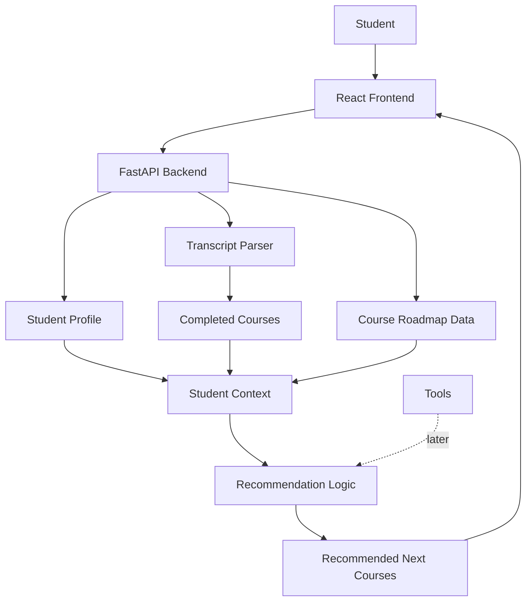
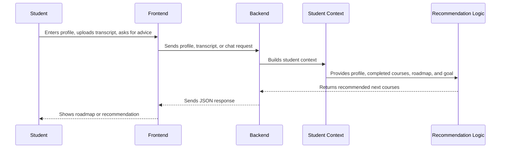

# Rebuild Overview

This document is the short mental model for rebuilding the course recommendation system.

The goal is clarity first. Do not build every component at once.

## What We Are Building

We are building a course recommendation system for NTU students.

At a high level, the system should:

- Show the student's course roadmap
- Store the student's profile
- Extract completed courses from a transcript
- Recommend suitable next courses
- Later improve recommendations using job market data and AI

## Simple Architecture



## Key Idea

The roadmap, completed courses, student profile, and chat recommendation are not isolated features.

They connect through `Student Context`.

`Student Context` includes:

- Degree
- Cohort
- Specialisation
- Completed courses
- Available courses
- Prerequisites
- Career goal or chat query

The `Transcript Parser` is a tool. It reads the transcript and outputs `Completed Courses`.

The `Completed Courses` then become part of `Student Context`.

`Tools` is a placeholder for future helpers such as job market data, course graph search, semantic search, AI workflow, or LLM response generation.

The recommendation logic should eventually use this context to answer:

```text
Given what this student has completed and what they want to become,
what courses should they take next?
```

## Simple Sequence Diagram



## Implementation Order

This file only explains the architecture and request flow.

For rebuild phases, milestones, and coding rules, follow `AGENTS.md`.
