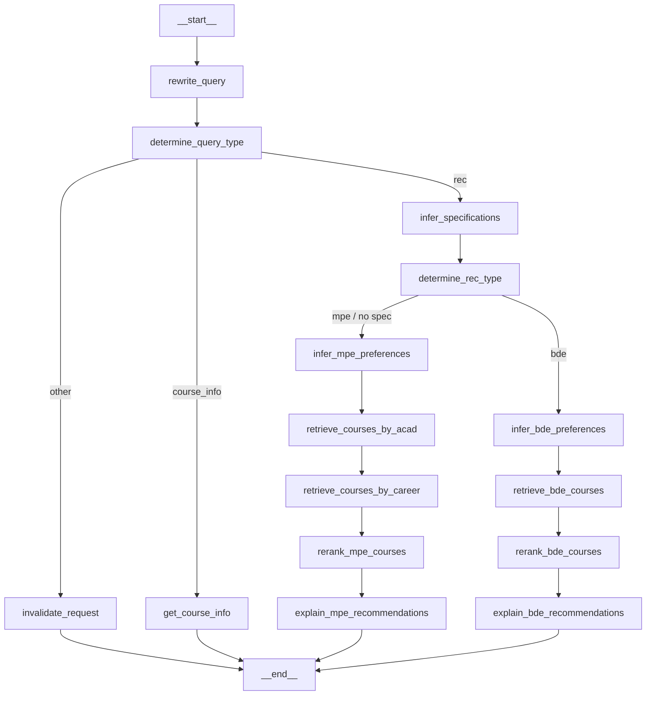
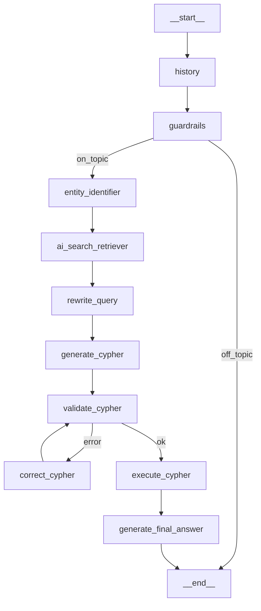

# FYP Course Recommendation Projects — Comparative Overview

> [!NOTE]
> Three projects, all targeting NTU CCDS/SCSE students, all building some form of course recommendation or planning system. Two are by the same author (Shing Hao), one is a standalone project by a separate team.

---

## 📦 The Three Projects at a Glance

| | **NTU Roadmaps** (Shing Hao) | **CourseNavigator** | **NTU CourseGenie** |
|---|---|---|---|
| **Author** | Shing Hao | Separate team | Separate team |
| **Repos** | 2 repos (frontend + backend) | 1 repo (monorepo) | 1 repo |
| **Frontend** | React + TypeScript + Vite | React (CRA) + JavaScript | Python + Streamlit |
| **Backend** | Node.js + Azure Functions (TypeScript) | Python + FastAPI | Python (runs within Streamlit) |
| **Database** | Azure Cosmos DB (NoSQL) | Neo4j + Firebase Firestore | Neo4j + MongoDB (CosmosDB API) + Azure AI Search |
| **AI/ML Used?** | ❌ No ML | ✅ Yes — LLM + Graph RAG + ML pipeline | ✅ Yes — LLM + Graph RAG |
| **Recommendation Type** | Rule-based career-elective mapping | Agentic Graph RAG with dual-channel vector retrieval | Agentic Graph RAG with Text-to-Cypher |
| **User Auth** | None | Firebase Auth (email/password) | Microsoft MSAL (NTU SSO) |
| **Deployment** | Azure Function App + Vercel | Local / self-hosted | Streamlit app |
| **Monitoring** | None | None | Langfuse tracing |

---

## 1. NTU Roadmaps (Shing Hao) — Two Repos

**Purpose:** Interactive visual curriculum planner and elective recommender for NTU SCSE undergrads.

### Architecture

```
┌────────────────────────────────────┐
│         FRONTEND (Vite + React)    │
│  ntu-roadmaps                      │
│                                    │
│  RoadmapSelects (cascading MUI)    │
│  → RoadmapView (@xyflow/react DAG) │
│    → CourseNode                    │
│    → SemesterNode                  │
│    → PrerequisiteGraph (mini DAG)  │
│  → CurriculumTable (alt view)      │
│  → CourseModal (drawer + electives)│
│                                    │
│  State: Zustand + localStorage     │
│  Fetch: React Query + Axios        │
└──────────────┬─────────────────────┘
               │ REST (optional)
┌──────────────▼─────────────────────┐
│        BACKEND (Azure Functions)   │
│  ntu-roadmaps-backend              │
│                                    │
│  GET /api/degrees                  │
│  GET /api/careers/{degree}         │
│  GET /api/course/{courseCode}      │
│  GET /api/roadmap/{degree}/{...}   │
│  POST /api/import/json/*           │
│  DELETE /api/*                     │
│                                    │
│  Zod validation → Cosmos DB repos  │
└──────────────┬─────────────────────┘
               │
┌──────────────▼─────────────────────┐
│       Azure Cosmos DB (NoSQL)      │
│  Containers:                       │
│  - Courses                         │
│  - Careers                         │
│  - Roadmaps                        │
│  - Degrees                         │
└────────────────────────────────────┘
```

### How Recommendations Work

> [!IMPORTANT]
> **No machine learning.** 100% deterministic, expert-curated mapping.

1. **Career Selection** — User picks one of 24 predefined tech career pathways (e.g. *AI Engineer*, *DevOps Engineer*, *Quantitative Analyst*). Each career is tagged with the degrees it's compatible with.
2. **Elective Mapping** — Each career has a hardcoded list of recommended elective course codes. When a user selects their career, the elective slots on the roadmap are populated with that career's curated electives.
3. **Interactive Substitution** — Elective placeholder nodes (e.g. `SCxxxx`) on the graph can be clicked to open a dropdown (`SelectElective`) showing only the electives recommended for the chosen career. Selecting one replaces the placeholder with the full course details.
4. **Prerequisite Engine** — A separate (non-recommendation) BFS traversal engine highlights the entire prerequisite chain for any selected course, and dynamically locks/unlocks courses based on what the student has marked as completed.

**The 24 career pathways include:** Blockchain Engineer, DevOps, Cloud Engineer, MR/VR Developer, Cyber Security, Software Engineer, Full-Stack, Frontend, Backend, Data Engineer, Business Analyst, Firmware Engineer, Computer Hardware, Embedded Systems, AI Engineer, ML Engineer, Data Scientist, Data Analyst, AI Scientist, System Architect, Cybersecurity Consultant, Product Manager, Entrepreneur, Quantitative Analyst.

### Data Storage

| Layer | What's Stored |
|---|---|
| **Azure Cosmos DB** | Courses, Careers, Roadmaps, Degrees (cloud, persistent) |
| **`localStorage` (browser)** | Completed courses list (`"completed-courses"`), user selections (`"roadmap-selects"`) |
| **Static JSON files** (`src/data/`) | Full offline fallback: `careers.json`, `courses.json`, `degreeProgrammes.json`, `roadmapdata.json` |
| **User file export** | `saved_roadmap.json` (exported/imported via HTML5 FileReader) |

> [!TIP]
> The frontend can operate **completely standalone** without the backend — it falls back to bundled local JSON files. A `VITE_IS_USE_BACKEND_DATA` env flag controls which mode is used.

### Key Tech Stack

- **Frontend:** React 18, TypeScript, Vite, `@xyflow/react` (interactive DAG), MUI v5, Zustand, React Query, `html-to-image`
- **Backend:** Node.js 20, TypeScript, Azure Functions v4, `@azure/cosmos`, Zod, Jest
- **CI/CD:** GitHub Actions → Azure Function App

---

## 2. CourseNavigator — One Monorepo

**Purpose:** Full-featured academic planning platform with AI chatbot, course explorer, roadmap editor, and job-market-grounded recommendations.

### Architecture

```
┌─────────────────────────────────────────────────────┐
│              FRONTEND (React + CRA)                 │
│  /app/client                                        │
│                                                     │
│  Auth: Firebase Auth (email/password)               │
│  Pages: LogIn, SignUp, Profile, Chat, Explore, Map  │
│  ChatInterface → POST /api/message → FastAPI        │
│  RoadMap → 4-year editable visual plan              │
│  Explore → course catalog with spec filters         │
│  CourseDetailsSideBar → prereq trees, AU info       │
└──────────────────────────┬──────────────────────────┘
                           │ REST
┌──────────────────────────▼──────────────────────────┐
│              BACKEND (FastAPI + Python)             │
│  /app/fastapi                                       │
│                                                     │
│  GET  /api/courses/{degreeCode}                     │
│  GET  /api/course/{courseCode}                      │
│  GET  /api/courses/{degreeCode}/{courseType}        │
│  GET  /api/courses/{degreeCode}/MPE/{specId}        │
│  GET  /api/bde/{degreeCode}                         │
│  POST /api/message   ← main AI chat endpoint        │
└──────────────────────────┬──────────────────────────┘
                           │
┌──────────────────────────▼──────────────────────────┐
│         LangGraph Agentic Workflow                  │
│  /app/fastapi/utils/workflow.py                     │
│                                                     │
│  rewrite_query                                      │
│    → determine_query_type                           │
│      ├─ "other"       → invalidate_request          │
│      ├─ "course_info" → get_course_info             │
│      └─ "rec"         → infer_specifications        │
│           → determine_rec_type                      │
│             ├─ MPE: infer_mpe_preferences           │
│             │       → retrieve_by_acad (embedding)  │
│             │       → retrieve_by_career (embedding)│
│             │       → rerank_mpe (LLM 0-1 score)    │
│             │       → explain_mpe                   │
│             └─ BDE: infer_bde_preferences           │
│                     → retrieve_bde (embedding)      │
│                     → rerank_bde (LLM 0-1 score)    │
│                     → explain_bde                   │
└──────────────────────────┬──────────────────────────┘
         ┌─────────────────┴──────────────────┐
         ▼                                    ▼
┌────────────────────┐             ┌─────────────────────┐
│  Neo4j Graph DB    │             │  Firebase Firestore  │
│  Course nodes      │             │  Users collection   │
│  Degree nodes      │             │  - profile fields   │
│  Career nodes      │             │  - savedCourses     │
│  Vectors embedded  │             │  - roadmap object   │
│  GDS cosine sim    │             │  - chatHistory      │
└────────────────────┘             └─────────────────────┘
```

### How Recommendations Work

> [!IMPORTANT]
> **Agentic Graph RAG** — combines LLM reasoning, vector embedding similarity, Neo4j Cypher queries, and real-world job market data.

**Step-by-step for MPE (Major Prescribed Electives):**

1. **Query Rewriting** — LLM resolves pronouns and follow-up references in the conversation into a self-contained question.
2. **Intent Classification** — LLM classifies the query as `course_info`, `rec`, or `other`.
3. **Specification Extraction** — LLM extracts constraints (e.g. *"no advanced math"*, *"Sem 1 only"*, *"I've already taken SC4001"*).
4. **Preference Inference** — LLM extracts `academicInterests` (e.g. Computer Vision) and `careerInterests` (e.g. ML Engineer) from the query + chat history + user profile.
5. **Dual-Channel Candidate Retrieval:**
   - *Academic channel:* Embeds academic interests → Cypher + Neo4j GDS cosine similarity against `course_description_embeddings` → top 5 courses per interest.
   - *Industry channel:* Embeds career interests → finds matching `:Career` nodes in graph → retrieves `aggregatedSkills` (real Adzuna job data) → embeds skills → cosine similarity → top 10 skill-matching courses.
6. **LLM Reranking** — Merges candidates, fetches `inferredSummary` (LLM-generated structured summaries per course), asks LLM to score each course 0–1 for suitability, picks top 3.
7. **Personalized Explanation** — LLM writes a justification referencing the student's specific degree, specialisation, and goals.

**BDE (Broadening & Deepening Electives):** Same pattern but starts with inferring complementary interdisciplinary domains (e.g. Psychology, Business) and searches across all BDE courses.

**Data preparation pipeline (offline, one-time):**
- Scrapes Singapore IT job ads via Adzuna API
- Clusters them into career categories using BERTopic (`all-MiniLM-L6-v2`)
- Classifies job sentences using TF-IDF + Linear SVM
- Extracts skills using SkillNer (SpaCy + `en_core_web_lg`)
- Results stored as `career_skills_aggregated.csv` → loaded into Neo4j `:Career` nodes

### Data Storage

| Layer | What's Stored |
|---|---|
| **Neo4j Graph DB** | Courses, Degrees, Schools, Career nodes, Types (CORE/MPE/BDE/ICC), Prerequisites, Specialisation tracks, Semester offerings, Vector embeddings |
| **Firebase Firestore** | User profiles (degree, cohort, specialisations), saved courses, 4-year roadmap, chat history |
| **Local JSON/CSV files** | `courses.json`, `roadmapdata.json`, `degreeProgrammes.json`, precomputed embedding JSONs (~12MB), BERTopic model artifacts, Adzuna job corpus |
| **Client memory** | React state for active session (synced to Firestore on change) |

### Key Tech Stack

- **Frontend:** React 18, JavaScript, React Router v7, Firebase SDK v11, FontAwesome, react-markdown
- **Backend:** Python 3.12, FastAPI, Uvicorn, Pydantic v2
- **AI/LLM:** LangGraph, LangChain, Azure OpenAI (GPT-4 / GPT-3.5), Azure OpenAI Embeddings
- **Databases:** Neo4j v5.28, Firebase Firestore, local JSON
- **ML/NLP:** BERTopic, scikit-learn (SVM, Naive Bayes), SkillNer, SpaCy, sentence-transformers
- **Evaluation:** RAGAS (RAG evaluation framework)

---

## 3. NTU CourseGenie — One Repo

**Purpose:** AI chatbot for course information retrieval and personalised recommendations, with a visual Mermaid roadmap and degree audit upload capability.

### Architecture

```
┌──────────────────────────────────────────────────┐
│           FRONTEND (Python + Streamlit)          │
│  /course_v2                                      │
│                                                  │
│  Auth: Microsoft MSAL (NTU SSO / Azure AD)       │
│                                                  │
│  Pages:                                          │
│  app.py        → router (login, role dispatch)   │
│  getStarted.py → onboarding form + file upload   │
│  chatbot.py    → chat UI + Mermaid roadmap       │
│  user.py       → profile viewer                  │
│                                                  │
│  Roadmap: streamlit-mermaid (Mermaid diagram)    │
│  Feedback: streamlit-feedback (emoji scores)     │
│  Monitoring: Langfuse callbacks on every query   │
└────────────────────────┬─────────────────────────┘
                         │ (in-process, no REST)
┌────────────────────────▼─────────────────────────┐
│          LangGraph Agentic Workflow               │
│  /course_v2/functions                            │
│                                                  │
│  START                                           │
│    → history (retrieves chat history)            │
│    → guardrails (validates topic relevance)      │
│      ├─ OFF_TOPIC → END                          │
│      └─ ON_TOPIC                                 │
│          → entity_identifier                     │
│          → ai_search_retriever (Azure AI Search) │
│          → rewrite_query                         │
│          → generate_cypher (few-shot Text2Cypher)│
│          → validate_cypher (syntax check)        │
│            ├─ error → correct_cypher → validate  │
│            └─ ok    → execute_cypher             │
│                         → generate_final_answer  │
│                              → END               │
└────────────────────────┬─────────────────────────┘
      ┌──────────────────┼──────────────────┐
      ▼                  ▼                  ▼
┌──────────┐    ┌────────────────┐    ┌──────────────┐
│  Neo4j   │    │  Azure AI      │    │   MongoDB    │
│  Graph   │    │  Search        │    │  (CosmosDB   │
│  DB      │    │  (vector index │    │   API)       │
│          │    │   for courses  │    │              │
│  Course  │    │   & degrees)   │    │  users coll  │
│  Degree  │    │                │    │  - profile   │
│  Prereqs │    └────────────────┘    │  - roadmap   │
│  Types   │                         │  - career    │
└──────────┘                         └──────────────┘
```

### How Recommendations Work (Chat — Text-to-Cypher GraphRAG)

> [!IMPORTANT]
> **Agentic Text-to-Cypher GraphRAG** — LLM translates natural language into Cypher queries, executes them against Neo4j, then generates a natural language answer. Azure AI Search provides supplementary entity retrieval.

**Step-by-step pipeline:**

1. **History Retrieval (`history_agent.py`)** — GPT-4o-mini rewrites the current query using prior chat history. Only rewrites if the query contains pronouns like "it" that reference a previous entity (e.g. "Tell me more about it" → "Tell me more about SC4001").

2. **Guardrails (`guardrail_agent.py`)** — GPT-4o-mini classifies the query as `"courses"` (course/degree/school related — includes AU, MPE, BDE, 3k/4k modules, mods, graduation queries) or `"end"` (off-topic). Off-topic queries receive a polite refusal and the workflow stops immediately.

3. **Entity Identification (`entity_identifier.py`)** — LLM extracts named entities (e.g. `SC1003`, `Computer Science`) and classifies each as `COURSE` or `DEGREE`, along with search queries to look them up.

4. **Azure AI Search Retrieval (`entity_retriever.py`)** — For each entity, calls `AISearch_retriever` with either `course_retriever()` or `degree_retriever()` to fetch relevant context documents from the Azure AI Search index.

5. **Query Rewriting (`rewrite_query.py`)** — Incorporates retrieved search context + chat history to produce a clean, self-contained query for Cypher generation.

6. **Cypher Generation (`graph_retriever.py → generate_cypher`)** — GPT-4o-mini translates the query to Cypher using:
   - The full Neo4j `enhanced_graph.schema` (auto-refreshed on init)
   - 5 semantically-selected few-shot examples via `SemanticSimilarityExampleSelector` (Azure embeddings + Neo4j vector store)
   - Strict prompt: respond with Cypher only, no backticks, no explanation

7. **Cypher Validation (`validate_cypher`)** — Runs `EXPLAIN <cypher>` on Neo4j. If `CypherSyntaxError` is raised, adds the error to `cypher_errors` and routes to correction. If clean, routes to execution.

8. **Cypher Correction (`correct_cypher`)** — GPT-4o rewrites the Cypher statement based on the error + enhanced schema. Routes back to validation (can loop until valid).

9. **Cypher Execution (`execute_cypher`)** — Runs the validated Cypher against `enhanced_graph.query()`. Returns a fallback "couldn't find relevant information" string if no results.

10. **Answer Generation (`generate_final_answer`)** — GPT-4o synthesises database records into a definitive plain-language answer. Has explicit instructions for interpreting prerequisite schema fields: `yearReqs`, `groupLogic` (OR/AND), `groupReqs`, `directReqs`. If no prerequisites exist, responds with "There are no prerequisites for this course."

---

### Degree Audit Upload Pipeline (unique to CourseGenie)

Current students can upload their **official NTU degree audit** (PDF or image) to auto-populate completed courses.

```
User uploads PDF / PNG / JPG
          │
          ▼
  process_files.py
          │
    ┌─────┴──────────────┐
    │ PDF?               │ Image (PNG/JPG)?
    ▼                    ▼
convert_pdf_to_image   base64 encode directly
(pdf2image + pillow)   │
    └─────┬────────────┘
          ▼
  analyse_image.py  ← GPT-4o Vision (multimodal)
  Extracts per-course:
  - Course Code     (e.g. "SC1005")
  - Course Title    (e.g. "Digital Logic")
  - Grade           (A+, A, B+, ..., F, P, EX, S, U)
  - Course Type     (C = Core / P = MPE / BDE)
  - Year & Semester (e.g. "Year2_Semester1")
  - is_Completed    (bool, always True by default)
          │
          ▼
  Returns List[CourseImage] validated via Pydantic
          │
          ▼
  Displayed in editable st.data_editor table
  for student to review/correct before submitting
```

**Pydantic models (`utils/models/course.py`):**

| Model | Fields |
|---|---|
| `CourseImage` | `Code`, `Title`, `Grades`, `CourseType` (Literal `C`/`P`/`BDE`), `Year` (Literal of all 12 semester slots), `is_Completed` |
| `Courses` | Wraps `List[CourseImage]` |
| `CourseInfo` | `courseCode`, `courseType` — lightweight version stored per semester |
| `CourseData` | 12 optional semester slots, each holding `List[CourseInfo]` |
| `CareerFeedback` | `career` (Literal of 24 career titles), `explanation`, `strength`, `weakness` |

---

### Career Feedback System

On profile submission, `feedback_career.py` makes a GPT-4o-mini call acting as a career advisor:

- **Inputs:** student's degree, career interests, completed courses with grades
- **Grading system explained to LLM:** A+→F, P (pass/fail), EX (exempted), S/U (satisfactory/unsatisfactory)
- **Output (`CareerFeedback`):**
  - `career` — one of the same **24 career Literals** used in Shing Hao's system (e.g. `"AI Engineer"`, `"Data Scientist"`)
  - `explanation` — detailed justification
  - `strength` — short academic strengths summary
  - `weakness` — short areas-to-improve summary

Displayed on chatbot page as ✅ green banner (strength), ⚠️ yellow banner (weakness), and an expandable explanation section.

---

### Roadmap Generation & Mermaid Diagram

**`generate_updated_roadmap.py`** — GPT-4o-mini acts as an academic programme planner:
- Compares the default degree schedule with student's completed modules
- Redistributes missing modules into upcoming semesters (balanced workloads)
- Handles MPE/BDE placeholders; MOOCs are counted as BDE not MPE
- Outputs structured `CourseData` Pydantic model (12 semester slots)

**`create_mermaid.py`** — Converts `CourseData` into a Mermaid `timeline` diagram string:
- Iterates Years 1–5, Semesters 1–2 + Special Semesters; skips empty years
- Appends a **"Recommended_MPE" section** from `Careers_with_key.json` (same curated career→elective mapping as Shing Hao's system)

Rendered inline in Streamlit via `streamlit-mermaid`. Students can **Add / Replace / Delete** courses via dialog popups, with changes saved back to MongoDB immediately.

---

### Authentication Flow (Microsoft MSAL — NTU SSO only)

```
User visits app
    │
    ▼
Terms of Use consent form (must tick checkbox first)
    │
    ▼
Redirect to Microsoft Azure AD (NTU SSO)
    │
    ▼
Returns with auth_code in URL query params
    │
    ▼
acquire_token_by_authorization_code() via MSAL
    │
    ├─ Validates email ends with "ntu.edu.sg"
    │   └─ Non-NTU email → Unauthorised error
    │
    ├─ Fetches profile photo via Microsoft Graph API
    │
    ├─ Checks MongoDB for existing user (by Azure OID)
    │   ├─ Found     → role = "Student"    → chatbot.py
    │   └─ Not found → role = "NewStudent" → getStarted.py
    │
    └─ Stores in session_state: user, email, OID, MongoDB connection
```

> [!NOTE]
> The Azure Object ID (OID) from the MSAL token is used directly as the MongoDB document `_id`. Only verified NTU email addresses are permitted.

---

### Pages & Modules Summary

| File/Module | Role |
|---|---|
| `app.py` | Entry point — Streamlit multi-page router, MSAL session init, role-based dispatch |
| `getStarted.py` | New student onboarding — degree/cohort/career selection, degree audit upload, profile saved to MongoDB |
| `chatbot.py` | Main chat UI — loads profile from MongoDB, renders Mermaid roadmap with Add/Replace/Delete controls, streams LangGraph steps, captures emoji feedback |
| `user.py` | Profile editor — same form as `getStarted.py` but pre-filled; allows re-upload of degree audit and updating career/degree info |
| `functions/workflow/retrieval_workflow.py` | Defines and compiles the LangGraph `StateGraph` (9 nodes + conditional edges); saves `graph.png` on compile |
| `functions/agents/general_agent/guardrail_agent.py` | LLM topic filter — routes to `"courses"` or `"end"`; understands NTU jargon (AU, MPE, BDE, 3k/4k, mods) |
| `functions/agents/general_agent/history_agent.py` | LLM query rewriter — resolves pronouns using chat history |
| `functions/agents/infoRetrieval_agent/entity_identifier.py` | LLM entity extractor — classifies named entities as COURSE or DEGREE |
| `functions/agents/infoRetrieval_agent/entity_retriever.py` | Azure AI Search retriever — fetches context for COURSE and DEGREE entities |
| `functions/agents/infoRetrieval_agent/graph_retriever.py` | Core GraphRAG engine — Text2Cypher, validation, correction loop, execution, answer synthesis |
| `utils/academic_profiling/process_files.py` | Orchestrates file upload: PDF→image→base64→GPT-4o Vision |
| `utils/academic_profiling/analyse_image.py` | GPT-4o multimodal call — extracts structured `List[CourseImage]` from degree audit image |
| `utils/academic_profiling/feedback_career.py` | GPT-4o-mini call — career advisor generating `CareerFeedback` (career + explanation + strength + weakness) |
| `utils/course_roadmap_utils/generate_updated_roadmap.py` | GPT-4o-mini call — academic planner producing personalised 4/5-year `CourseData` |
| `utils/course_roadmap_utils/create_mermaid.py` | Converts `CourseData` to Mermaid `timeline` string + appends recommended MPE from `Careers_with_key.json` |
| `utils/Database/DBConnector.py` | MongoDB connection via `pymongo.MongoClient` (Azure CosmosDB MongoDB API) |
| `login_utils/login_ui.py` | Full MSAL OAuth2 flow: consent → NTU SSO → token exchange → email validation → MongoDB lookup → role assignment |
| `langfuse_utils/langfuse_app.py` | Logs per-response `accuracy` score (0.2–1.0 from emoji) with optional text comment to Langfuse, keyed by `trace_id` |
| `ragas_eval/` | RAGAS evaluation harness — `RagasDatasets.csv` (219KB) + `RagasDatasetTest.csv` (8KB); `ragas_app.py` is a stub using BleuScore metric |

---

### Data Storage

| Layer | What's Stored |
|---|---|
| **Neo4j Graph DB** | Courses, Degrees, Schools, Prerequisites (OR/AND group logic + year standing), Types (CORE/MPE/BDE/ICC), Specialisation tracks, Semester offerings, vector embeddings for few-shot Cypher example selection |
| **MongoDB / Azure CosmosDB (MongoDB API)** | `users` collection keyed by Azure OID: `userId`, `name`, `email`, `last_updated` (profile), `coursedata` (uploaded courses), `career_path` (CareerFeedback), `generated_course` (personalised roadmap per semester) |
| **Azure AI Search** | Vector/keyword index over course and degree documents for entity-based pre-retrieval |
| **Local JSON files** | Per-degree schedule files (`CSC_schedule.json` etc.), `Careers_with_key.json` (career→MPE elective mapping), option configs |
| **Streamlit `session_state`** | Active session: user name/email/OID, MongoDB connection, chat messages + run IDs, career output, course data, roadmap, profile |
| **Langfuse (cloud)** | LLM trace logs keyed by `run_id` + `chat_id`; per-response `accuracy` scores (0.2–1.0) with optional text comments |
| **RAGAS test datasets** | `RagasDatasets.csv` (219KB full set) + `RagasDatasetTest.csv` (8KB) in `ragas_eval/testDatasets/` |

### Key Tech Stack

- **Frontend/App:** Python 3, Streamlit 1.41, streamlit-mermaid, streamlit-feedback, streamlit-msal
- **Auth:** Microsoft MSAL (`msal` ConfidentialClientApplication + Microsoft Graph API for profile photo); NTU `ntu.edu.sg` email enforcement
- **AI/LLM:** LangGraph 0.2.60, LangChain 0.3.13, Azure OpenAI — GPT-4o (vision OCR, Cypher correction, answer gen), GPT-4o-mini (guardrails, history, career feedback, roadmap gen, Cypher gen)
- **Databases:** Neo4j 5.27, MongoDB (pymongo 4.10) via Azure CosmosDB, Azure AI Search 11.5.2, Azure Cosmos DB 4.9.0
- **File processing:** `pdf2image`, `pillow`, `base64` for degree audit ingestion
- **Monitoring:** Langfuse 2.59.3 — full LLM trace per invocation + per-response emoji feedback logged as `accuracy` metric
- **Testing/Eval:** pytest, RAGAS 0.2.13 (BleuScore; datasets in `ragas_eval/testDatasets/`)

---

## 🔍 Similarities Across All Three

| Feature | NTU Roadmaps | CourseNavigator | NTU CourseGenie |
|---|:---:|:---:|:---:|
| Targets NTU CCDS / SCSE students | ✅ | ✅ | ✅ |
| Course prerequisite handling | ✅ | ✅ | ✅ |
| Career-based course guidance | ✅ | ✅ | ✅ |
| 4-year degree roadmap view | ✅ | ✅ | ✅ |
| Neo4j knowledge graph | ❌ | ✅ | ✅ |
| Azure OpenAI (LLM) | ❌ | ✅ | ✅ |
| LangGraph orchestration | ❌ | ✅ | ✅ |
| User profile persistence | ❌ (localStorage only) | ✅ (Firestore) | ✅ (MongoDB) |
| User authentication | ❌ | ✅ | ✅ |
| Multi-turn chatbot | ❌ | ✅ | ✅ |
| Offline / static data fallback | ✅ | Partial | ❌ |

---

## 🆚 Key Differences

### Recommendation Approach
| | NTU Roadmaps | CourseNavigator | NTU CourseGenie |
|---|---|---|---|
| **Core method** | Expert-curated lookup table | Dual-channel embedding + LLM rerank | Text-to-Cypher + LLM answer generation |
| **AI involved?** | None | Yes — LLM inference + vector similarity | Yes — LLM inference + Cypher generation |
| **Industry data?** | No | Yes — Adzuna job scraping + BERTopic + SkillNer | No |
| **Deterministic?** | Fully deterministic | Non-deterministic (LLM-based) | Non-deterministic (LLM-based) |
| **Explainability** | None (implicit by career) | LLM-generated per-course explanation | LLM-generated natural language answer |
| **Elective types** | Manually curated per career | MPE and BDE (separate pipelines) | All course types (via Cypher query) |

### User Experience
| | NTU Roadmaps | CourseNavigator | NTU CourseGenie |
|---|---|---|---|
| **Interface style** | Interactive node graph (React Flow) | Tabbed web app with chat panel | Streamlit chatbot-first |
| **Roadmap format** | Interactive DAG with BFS highlighting | Editable 4-year grid | Mermaid timeline diagram |
| **Feedback mechanism** | EmailJS form | None | Per-response emoji ratings → Langfuse |
| **Degree audit upload** | No | No | Yes (PDF/image → OCR extraction) |

### Technical Sophistication
| | NTU Roadmaps | CourseNavigator | NTU CourseGenie |
|---|---|---|---|
| **Complexity** | ⭐⭐ Moderate | ⭐⭐⭐⭐ High | ⭐⭐⭐ Medium-High |
| **Data pipeline** | Static JSON files | Full NLP/ML pipeline (BERTopic, SVM, SkillNer) | None beyond graph construction |
| **Graph DB** | No | Neo4j (full schema + vectors + career nodes) | Neo4j (courses + prereqs + types) |
| **Observability** | None | None | Langfuse (full LLM tracing + user feedback) |
| **Testing** | Jest unit tests | RAGAS eval framework | pytest + RAGAS |

---

## 🗺️ Diagrams

### NTU Roadmaps — No static diagram files
The roadmap itself **is** the diagram — generated at runtime using `@xyflow/react` as an interactive DAG. No architecture diagrams are stored in the repo.

---

### CourseNavigator — LangGraph Workflow (from `neo4j/workflow.ipynb`)
Generated programmatically via `graph.get_graph().draw_mermaid_png()`:



---

### NTU CourseGenie — LangGraph Workflow (generated as `graph.png`)
Also generated programmatically; the `graph.png` file in `course_v2/functions/` and `course_v2/` represents this flow:



### NTU CourseGenie — System Architecture (from `assets/images/system_architecture.png`)
The README references `assets/images/system_archicture.png` (284 KB) showing a system architecture diagram, and `assets/images/user_flow.png` (180 KB) showing user flow. These are visual design assets stored in the repo.

---

## 📊 Summary: Which Project Does What Best

| Goal | Best Project | Why |
|---|---|---|
| **Visual curriculum planning** | NTU Roadmaps | Interactive DAG with BFS prereq highlighting, PNG export, dual views |
| **AI-powered course recommendations** | CourseNavigator | Industry-grounded via Adzuna job data + BERTopic + dual-channel vector retrieval |
| **Conversational course Q&A** | NTU CourseGenie | Text-to-Cypher GraphRAG handles arbitrary factual queries about any course |
| **User authentication & persistence** | CourseNavigator / CourseGenie | Both have cloud-persisted profiles; Roadmaps only uses localStorage |
| **Production observability** | NTU CourseGenie | Only project with Langfuse tracing and per-response feedback scoring |
| **Offline / no-backend capability** | NTU Roadmaps | Full static JSON fallback; can run frontend-only |
| **Simplest to understand** | NTU Roadmaps | No AI, clean TypeScript, deterministic logic |
| **Most technically ambitious** | CourseNavigator | Full ML data pipeline + graph RAG + Firebase + evaluation framework |
