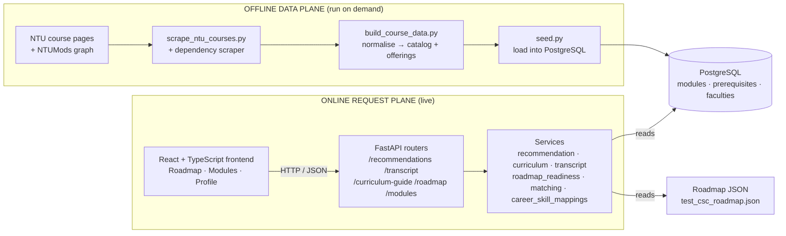
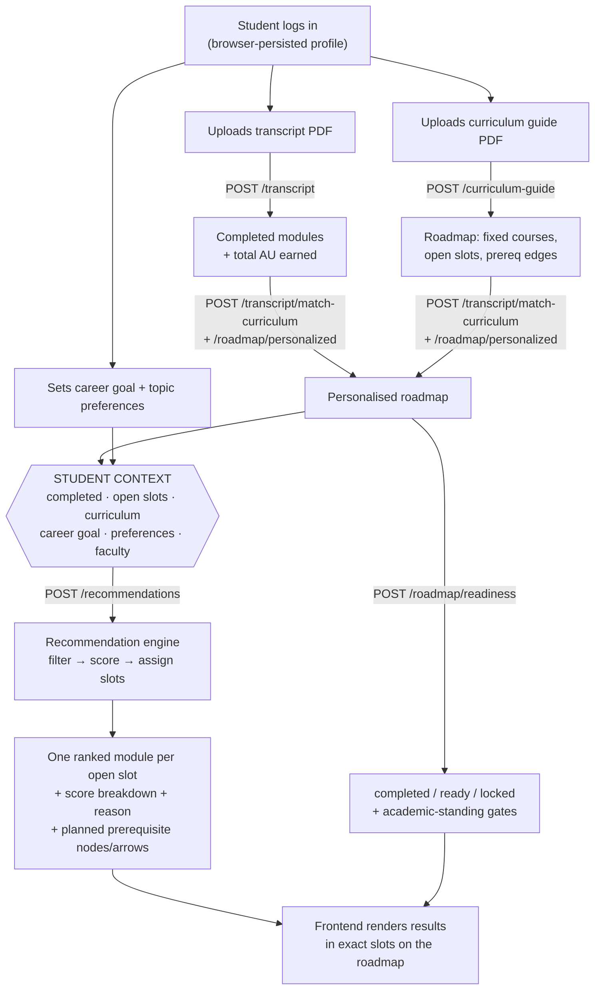
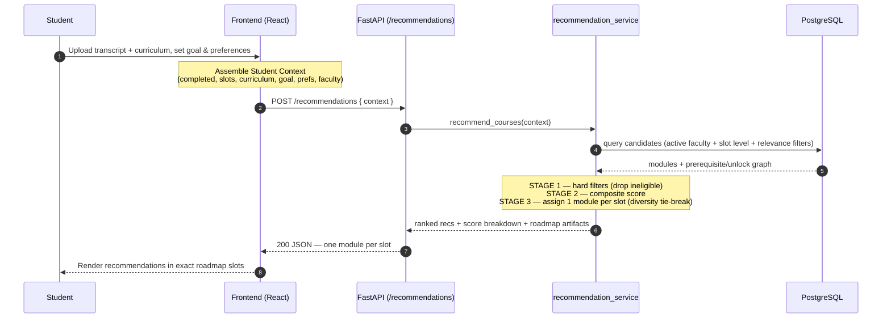
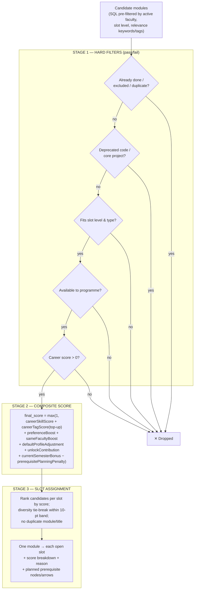
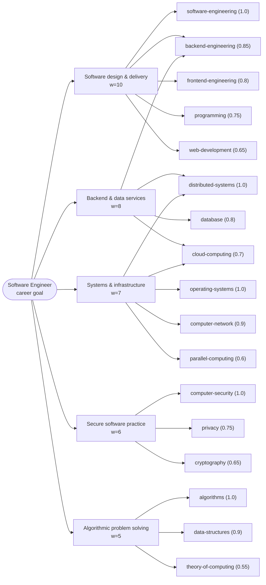

# FYP Course Recommendation System — System Overview & Handoff

> **Purpose of this document.** A complete, self-contained brief describing the NTU Course
> Recommendation System: its features, architecture, data flow, request sequence, and the
> reasoning inside its recommendation engine. It is written as source material for generating a
> presentation. Everything here is derived directly from the codebase — course codes, tag names,
> weights, and formulas are the real ones. Diagrams are provided as Mermaid (renders on
> GitHub/most viewers) so they can be reused or redrawn as needed.

---

## 1. One-paragraph summary

The system is a **full-stack academic advising tool for NTU students**. A student uploads their
**transcript** (PDF) and **curriculum guide** (PDF), sets a **career goal** and optional **topic
preferences**, and the system produces a **personalised roadmap** plus **ranked recommendations
for each open elective slot** (BDE and MPE choice slots). The recommendation engine is
**deterministic and rule-based** — it maps a career goal → weighted skill areas → curated module
tags → concrete modules, applies hard eligibility filters, computes a composite score, and assigns
exactly one module per open slot. Every recommendation returns a full **score breakdown** and a
human-readable **reason**, so nothing is a black box.

**Key design stance:** No ML, embeddings, or LLM in the ranking path (yet). This is a deliberate
choice — recommendations are *explainable and reproducible*, and the career→skill mapping is a
clean seam where job-market data or learned weights can be added later.

---

## 2. Technology stack

| Layer | Technology |
|---|---|
| Frontend | React 19, TypeScript, Vite, Zustand (state), `@xyflow/react` (roadmap graph) |
| Backend | FastAPI (Python), Pydantic schemas, SQLAlchemy ORM, Uvicorn |
| Database | PostgreSQL |
| PDF parsing | PyMuPDF (`fitz`) |
| Data pipeline | Standalone Python scrapers (NTU course pages + NTUMods prerequisite graph) |
| Frontend↔Backend | REST / JSON over HTTP (CORS-restricted to localhost dev ports) |

**Scope note:** Currently supports one major (**CSC — Computer Science**) and one career goal
(**Software Engineer**). No backend user accounts, no production auth — profile state is persisted
client-side in the browser (Zustand `persist`).

---

## 3. Feature breakdown

Grouped by responsibility. Group A is the data foundation, Group B is the recommendation engine
(the intellectual core), Group C is planning/UI support.

### Group A — Data foundation

**A1. Module data pipeline (offline scraper).**
An NTU course scraper (`scraper/scrape_ntu_courses.py`) fetches module pages across several
programmes and academic semesters (2022–2026); a separate script extracts the **NTUMods
prerequisite/unlock graph**. `build_course_data.py` normalises the raw output into two clean
datasets: a **catalog** (unique module details) and **offerings** (where/when each module is
taught). `seed.py` loads normalised data into PostgreSQL (modules, faculties, prerequisite
relationships). This decouples slow, brittle scraping from the live API — the API only ever *reads*
seeded data.

**A2. Transcript parsing & completed-course extraction** (`transcript_service.py`).
Accepts an NTU transcript **PDF**. Uses regex + PDF-layout heuristics to extract module codes
(pattern `[A-Z]{2,4}\d{4}`), titles, academic units (AU), and grades. Passing grades **plus
exemptions (EX) and transfer credit (TC)** count as completed. Also extracts **total AU earned**,
which later drives academic-standing checks. Endpoint: `POST /transcript`.

**A3. Curriculum guide parsing & roadmap building** (`curriculum_service.py`, `personalized_roadmap_service.py`).
Parses a curriculum-guide **PDF** into a semester-by-semester roadmap: fixed modules, **open choice
slots** (`BDE`, `SC3xxx`, `SC4xxx`), prerequisite edges, cohort, major, and total AU. A **matching
service** (`transcript_matching_service.py`) reconciles the transcript against the curriculum — by
exact code first, then conservative title-signature matching (to handle course-code changes, e.g.
old `CZ` codes → new `SC` codes) — producing a **personalised roadmap** showing what's done, what's
left, and where completed modules land. Endpoints: `POST /curriculum-guide`,
`POST /transcript/match-curriculum`, `POST /roadmap/personalized`.

### Group B — Recommendation engine (`recommendation_service.py`)

**B1. Hard eligibility filters (pass/fail, before any scoring).**
A candidate is dropped if it is:
- already completed or explicitly excluded (already in the roadmap), or a **near-duplicate** of
  prior learning (title-signature match);
- a **deprecated code family** (`CE`, `CSC`, `CZ`, `CPE` prefixes — current curricula use `SC`);
- a **non-recommendable core project** (`SC2079`, `SC3099`);
- **unavailable to the student's programme** (or unavailable as a BDE/UE to the programme);
- not a fit for the slot's **level and type** (MPE slots must be CSC at the matching level; BDE
  slots fit the roadmap year's level).

Part of this filtering runs in **SQL** (faculty active-list, slot level, relevance keywords/tags)
so a broad BDE slot doesn't load the entire catalog into memory.

**B2. Career → skill → tag relevance scoring (the distinguishing feature).**
A career goal maps to weighted **skill areas**, and each skill area maps to curated module **tags**,
each with a *relationship weight* and a *tag confidence*. A module's career-skill contribution is:

```
contribution = skill_area_weight × relationship_weight × tag_confidence
```

For each skill area, only the **strongest matching tag** counts; the module's `careerSkillScore` is
the sum of those per-skill contributions (rounded). Raw keyword/tag matching provides a **fallback
top-up** (`careerTagScore`) only when it exceeds the mapped score — never double-counted. Fully
deterministic and inspectable. (Full mapping table in §7.)

**B3. Soft boosts & personalisation.**
Applied on top of career relevance:
- **Topic preferences** boost matching tags with **diminishing returns** (first match `+35`, then
  `+12, +8, +6, +4`, capped at `+60`) — so one topic can't dominate.
- **Same-faculty** modules get `+8`.
- **Broad-default / specialist profile** metadata: in no-preference contexts, `broad-default`
  modules get `+14`, `specialist` modules get `−16` — steering undecided students toward generally
  useful modules first.
- **Current-semester** availability bonus: `+3`.
- Preferences are **soft boosts, never hard filters.**

**B4. Prerequisite-aware readiness & unlock value.**
Each candidate is checked against completed **and already-planned** modules:
- **Ready** modules rank freely (`readinessStatus: "ready"`).
- Modules whose missing prerequisite could be slotted into an *earlier* open slot stay visible but
  carry a **planning penalty** (`−20`) and emit **planned prerequisite nodes + arrows** onto the
  roadmap (`needs-prerequisite-planning`).
- Modules that **unlock later fixed curriculum modules** earn an **unlock bonus** (stepped
  `+4, +3, +2, +1`) — rewarding pathway value, not just point-in-time fit.

**B5. Diversity-aware slot assignment.**
The engine assigns **exactly one module per open slot** (not a flat list). Within each slot,
candidates are ranked by score; a **gentle diversity rule** breaks ties among similarly-strong
options (within a `10`-point band) by penalising repeated recommendation tags — so the final plan
isn't five near-identical modules. Diversity **never overrides** a clearly stronger career/pathway
match. No duplicate course code or title across the final set. Every recommendation returns a
`scoreBreakdown` and a `reason` string.

### Group C — Planning & UI support

**C1. Roadmap readiness & academic standing** (`roadmap_readiness_service.py`).
A separate endpoint (`POST /roadmap/readiness`) evaluates every roadmap course as
**completed / ready / locked** based on completed modules and prerequisites, and enforces
**academic-standing gates** (minimum AU earned before certain courses). This is what prevents the
UI from letting a student "complete" a course they aren't eligible for.

**C2. Module browser & faculty management.**
`GET /modules` (paginated, searchable, filterable by faculty/level/category/current-semester),
`GET /modules/{code}` (one module + prerequisites + unlocks), `GET /modules/filters` (dropdown
options). Faculty endpoints (`/faculties`, activate/deactivate) control which faculties' modules are
eligible — only **active** faculties appear in recommendations and browsing.

**C3. Interactive frontend.**
React + TypeScript SPA with three main views — **Roadmap**, **Modules**, **Profile** — plus a login
page. The roadmap is a visual graph (`@xyflow/react`). The frontend assembles the student context,
posts it, and renders the engine's slot assignments directly using `matchedChoiceSlotId`. The
backend owns ranking and allocation, so the UI stays a thin, predictable view over the reasoning.
Profile/roadmap state persists in the browser via Zustand.

---

## 4. Architecture

Two planes joined by one database. The **offline data plane** scrapes and normalises NTU data into
PostgreSQL on demand; the **online request plane** serves the React app through FastAPI and only
ever *reads* seeded data. The scraper never runs during a user request.



**Backend module layout** (`backend/`):
- `routers/` — thin HTTP layer (health, roadmap, roadmap_readiness, transcript, curriculum,
  faculties, modules, recommendations).
- `services/` — all business logic (recommendation_service, career_skill_mappings,
  curriculum_service, transcript_service, transcript_matching_service, roadmap_service,
  personalized_roadmap_service, roadmap_readiness_service, module_service, faculty_service).
- `models/` — SQLAlchemy models (`ModuleModel`, `FacultyModel`, `ModulePrerequisiteModel`).
- `schemas/` — Pydantic request/response contracts.
- `database/` — connection + seed.

**`ModuleModel` fields** (the seeded module row): `code`, `title`, `au`, `faculty`, `description`,
`level`, `categories`, `recommendation_tags`, `recommendation_profile` (`broad-default` /
`specialist`), `latest_year`, `latest_semester`, `is_current_semester`, `not_available_to_programme`,
`not_available_as_bde_ue_to_programme`.

---

## 5. Workflow — the student journey (data flow)

The core idea: four inputs converge into one **Student Context**, and the engine reasons over it.



**Plain-language steps:**
1. Student logs in (identified by student ID; profile persists in the browser).
2. Uploads transcript PDF → backend extracts completed modules + total AU.
3. Uploads curriculum guide PDF → backend builds the roadmap (fixed courses + open BDE/MPE slots).
4. Transcript is matched to the curriculum → a **personalised roadmap** is rendered.
5. Student sets career goal (Software Engineer) and optional topic preferences.
6. Frontend assembles the full context and calls `POST /recommendations`.
7. Backend filters, scores, and assigns **one module per open slot**, returning breakdowns +
   reasons + any planned prerequisite artifacts.
8. Roadmap readiness is evaluated in parallel to mark each course completed/ready/locked.
9. Frontend renders everything in place — it does **not** re-rank or reassign.

---

## 6. Sequence diagram — a recommendation request end to end

The runtime contract. The frontend assembles context and posts **once**; the backend does all
filtering, ranking, and slot allocation; the frontend renders the result directly.



**Contract notes:**
- Request body: `careerGoal`, `preferredRecommendationTags`, `studentFaculty`,
  `completedCourseCodes`, `choiceSlots` (with `slotId`/`year`/`semester`), `curriculumCourses`,
  `excludedCourseCodes`, `excludedCourseTitles`, `limit`.
- Response: `recommendations[]`, each with `courseCode`, `title`, `matchedChoiceSlotId`,
  `readinessStatus`, `unlockValue`, `score`, `scoreBreakdown`, `reason`, `prerequisites`,
  `plannedRoadmapNodes`, `plannedRoadmapEdges`.
- **Determinism:** same context → same plan. All reasoning is server-side.
- Only `careerGoal == "software-engineer"` currently returns results; others return an empty list
  by design.

---

## 7. The recommendation pipeline (the intellectual core)

A candidate module runs three stages: **hard filters** (correctness), **composite score**
(relevance), **slot assignment** (allocation).



### 7.1 Scoring components (exact values from code)

| Component | Value / rule | Field |
|---|---|---|
| Career-skill score | `Σ (skill_weight × relationship × confidence)`, strongest tag per skill | `careerSkillScore` |
| Career keyword/tag top-up | `max(0, raw_keyword_tag_score − careerSkillScore)` | `careerTagScore` |
| Preference boost | first `+35`, then `+12,+8,+6,+4`; cap `+60` | `preferenceBoost` |
| Same-faculty boost | `+8` if module faculty == student faculty | `sameFacultyBoost` |
| Broad-default profile | `+14` (no-preference context only) | `defaultProfileAdjustment` |
| Specialist profile | `−16` (no-preference context only) | `defaultProfileAdjustment` |
| Current-semester bonus | `+3` if `is_current_semester` | `currentSemesterBonus` |
| Unlock contribution | stepped `+4,+3,+2,+1` by unlock count | `unlockContribution` |
| Prerequisite planning penalty | `−20` when an extra prerequisite must be planned | `prerequisitePlanningPenalty` |
| Diversity tie-break penalty | `−8` per repeated tag (`−2` if the tag is a preferred tag), only within a 10-pt band | (applied at assignment) |
| **Final score** | `max(1, sum of the above)` | `finalScore` / `score` |

### 7.2 Career → skill → tag mapping (Software Engineer)

The career goal expands through a hand-curated, weighted graph. A module inherits the strongest path
that reaches it, so *"why was this recommended?"* always has a concrete answer.



**Full mapping (skill weight → tag: relationship_weight, confidence):**

| Skill area (weight) | Tag | Rel. weight | Confidence |
|---|---|---|---|
| **Software design & delivery (10)** | software-engineering | 1.0 | 1.0 |
| | backend-engineering | 0.85 | 1.0 |
| | frontend-engineering | 0.8 | 1.0 |
| | programming | 0.75 | 0.9 |
| | web-development | 0.65 | 0.9 |
| **Backend & data services (8)** | distributed-systems | 1.0 | 1.0 |
| | backend-engineering | 0.9 | 1.0 |
| | database | 0.8 | 1.0 |
| | cloud-computing | 0.7 | 0.9 |
| | web-development | 0.5 | 0.85 |
| **Systems & infrastructure (7)** | operating-systems | 1.0 | 1.0 |
| | distributed-systems | 0.95 | 1.0 |
| | computer-network | 0.9 | 1.0 |
| | cloud-computing | 0.75 | 0.9 |
| | parallel-computing | 0.6 | 0.85 |
| **Secure software practice (6)** | computer-security | 1.0 | 1.0 |
| | privacy | 0.75 | 0.9 |
| | cryptography | 0.65 | 0.9 |
| **Algorithmic problem solving (5)** | algorithms | 1.0 | 1.0 |
| | data-structures | 0.9 | 1.0 |
| | theory-of-computing | 0.55 | 0.85 |

**Worked example** (from the API's own example response):
`SC3002 Software Engineering` → skill *software design and delivery* (w=10) → tag
`software-engineering` (rel 1.0 × conf 1.0) → contribution `10.0` → `careerSkillScore = 10`, plus
`currentSemesterBonus = 1` and `unlockContribution = 1` → `finalScore = 12`. Reason string:
*"Recommended for the Software Engineer career goal. Also top career-skill path: Software Engineer →
software design and delivery → software-engineering → Software Engineering."*

### 7.3 Choice-slot rules

- **MPE slots** (`SC3xxx`, `SC4xxx`): candidates must be **CSC** faculty at the matching level
  (3xxx → level 3, 4xxx → level 4).
- **BDE slots**: broader — any active-faculty module, but each BDE slot fits its roadmap **year
  level** (`min(max(year,1),4)`), and modules unavailable as BDE/UE to the student's programme are
  excluded.

---

## 8. API endpoints reference

| Method | Path | Purpose |
|---|---|---|
| GET | `/health` | Health check |
| GET | `/roadmap` | Default CSC roadmap (static JSON) |
| POST | `/roadmap/personalized` | Merge curriculum + transcript into a personalised roadmap |
| POST | `/roadmap/readiness` | Mark each roadmap course completed / ready / locked + standing gates |
| POST | `/transcript` | Parse transcript PDF → completed modules + total AU |
| POST | `/transcript/match-curriculum` | Match transcript modules to curriculum rows |
| POST | `/curriculum-guide` | Parse curriculum guide PDF → structured roadmap data |
| POST | `/recommendations` | **Filter, score, assign one module per open slot** |
| GET | `/modules` | List/search/filter modules (paginated) |
| GET | `/modules/{code}` | One module + prerequisites + unlocks |
| GET | `/modules/filters` | Filter dropdown options |
| GET | `/faculties`, `/faculties/active`, `/faculties/inactive` | List faculties by status |
| PATCH | `/faculties/status`, `/faculties/{name}/activate`, `/faculties/{name}/deactivate` | Toggle faculty inclusion |

---

## 9. Scope & roadmap (for the "future work" slide)

**Built & working:** transcript & curriculum PDF parsing; personalised roadmap with prerequisite
edges; deterministic career-skill recommendation engine; per-slot BDE/MPE assignment; prerequisite
planning + unlock reasoning; readiness & academic-standing checks; module browser + faculty
management; a benchmark test suite for ranking quality
(`data/recommendation_benchmark_cases.json`); React roadmap-graph frontend.

**Deliberately deferred (each fits an existing seam):**

| Deferred item | Where it plugs in |
|---|---|
| More career goals beyond Software Engineer | New entries in `CAREER_SKILL_MAPPINGS` |
| Job-market data (real posting skill demand) | Replace hand-tuned weights in `career_skill_mappings.py` |
| ML / embedding ranking, semantic search | Sits beside the current SQL relevance filter |
| LLM-generated advice / conversational queries | New service consuming the same Student Context |
| Backend user accounts & persistence | Currently browser-side (Zustand); move to DB |
| Production authentication | Not yet implemented |
| More majors beyond CSC | Roadmap data + profile `major` union type |

The deterministic core is the **baseline** these enhancements will be measured against.

---

## 10. Suggested presentation structure

A ~10-minute flow. Spend the most time on §7 (the pipeline and the career mapping) — that's the
intellectual contribution.

1. **Problem & the arc** (~1.5 min) — students face dozens of eligible electives with no principled
   way to choose; everything converges into Student Context (§5).
2. **What's built** (~2 min) — feature list by group: data foundation, engine, planning (§3).
3. **Architecture** (~1 min) — two planes, one database; the API only reads seeded data (§4).
4. **The pipeline** (~3 min, spend time here) — filters = correctness, score = relevance,
   assignment = allocation (§7).
5. **Career mapping = the design decision** (~1.5 min) — deterministic & explainable; the seam for
   future job-market data (§7.2).
6. **Scope & next steps** (~1 min) — frame deferrals as designed seams (§9).

**Recommended diagrams to include:** (1) architecture two-plane diagram (§4), (2) student-journey
data flow (§5), (3) recommendation-request sequence diagram (§6), (4) the three-stage pipeline
(§7), (5) the career→skill→tag mapping (§7.2). A generic "workflow" diagram is unnecessary — it
overlaps the sequence diagram; the pipeline and mapping diagrams are what make this project distinct.

---

## 11. Talking points / anticipated questions

- **"Why no AI/ML?"** — Deliberate. An advising tool must be explainable and reproducible; a
  deterministic rule engine gives a defensible, debuggable baseline and a clean seam for adding
  data-driven ranking later. The career→skill mapping is explicitly designed as that seam.
- **"How do you know recommendations are good?"** — A benchmark suite of labelled cases
  (`recommendation_benchmark_cases.json` + predictions) is used to calibrate weights; recent commit
  history is largely score-calibration work against these benchmarks.
- **"Why one career / one major?"** — MVP scope; both are table-driven and extensible without
  changing the pipeline.
- **"What stops an ineligible course being recommended?"** — Stage-1 hard filters (completed,
  deprecated, wrong slot, programme-unavailable, prerequisite feasibility) run before any scoring;
  and `/roadmap/readiness` gates the UI.
- **"Where does the module data come from?"** — Offline scrape of NTU course pages + NTUMods
  prerequisite graph, normalised and seeded into PostgreSQL; never fetched live during a request.
